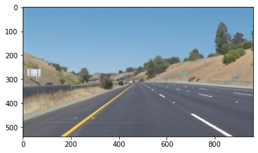
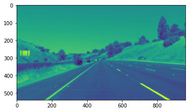
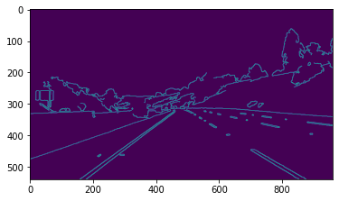
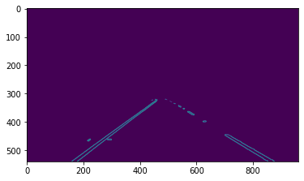
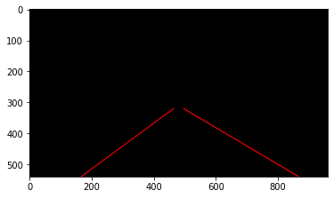
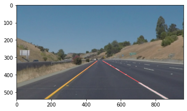

# **Finding Lane Lines on the Road** 

### Reflection

### 1. Describe your pipeline. As part of the description, explain how you modified the draw_lines() function.

My pipeline consisted of 5 steps. First, I converted the images to grayscale and included Gaussian smoothing, then I applied the Canny transform to detect the edges and an image mask to select the region of interest. Finally, I drew the hough lines.

 
▼
 

 
▼
 

 
▼
 

 
▼
 

 
▼
 

 
▼
 

In order to draw a single line on the left and right lanes, I modified the draw_lines() function by separating line segments by their slope ((y2-y1)/(x2-x1)) to decide which segments are part of the left line vs. the right line. Then, I averaged the position of each of the lines and extrapolated to the top and bottom of the lane.

### 2. Identify potential shortcomings with your current pipeline

One potential shortcoming would be what would happen when lines are hit by shadows, hidden by other cars or close to other similar features on the road. 

Another shortcoming could be identifying the lines if they get out of the region of interest like when a car changes lanes.

### 3. Suggest possible improvements to your pipeline

A possible improvement would be to use the HSV color space to deal with shadows.

Another potential improvement could be to use machine learning to identify lane lines.
